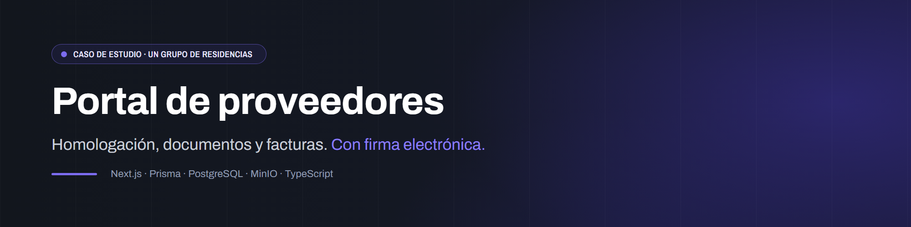
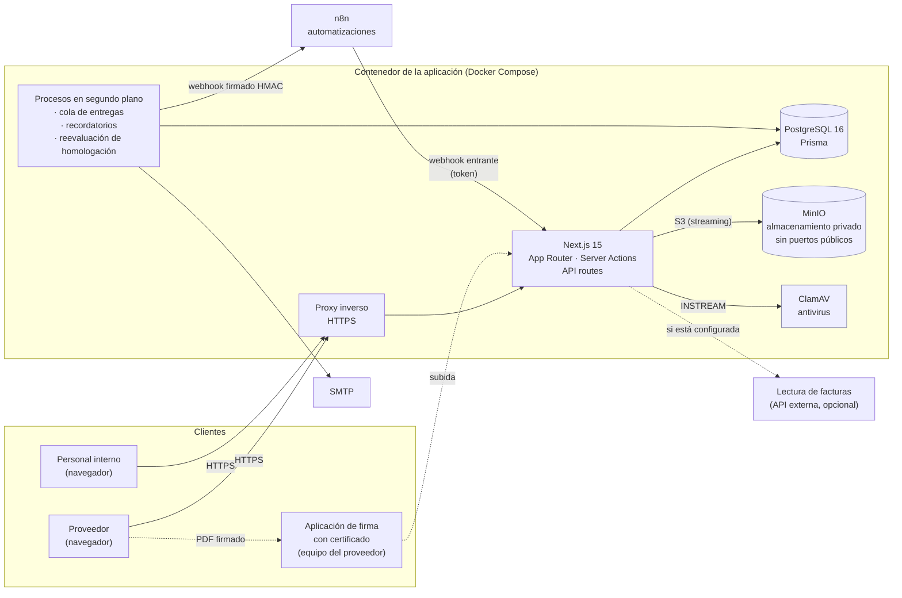

  

# Portal de proveedores · homologación, documentación, facturas y firmas

        

> [!NOTE]
> **Caso de estudio.** Aplicación desarrollada para un grupo de residencias. El código de producción es privado: aquí están el problema, la arquitectura, las decisiones técnicas y [fragmentos de código reescritos](snippets/) que ilustran las piezas más interesantes.

## El problema

Un grupo de residencias con varios centros trabaja con proveedores de actividades muy distintas: alimentación, mantenimiento, limpieza, servicios sanitarios, tecnología… Cada uno tiene que:

- **entregar documentación** (datos fiscales, seguros, formación preventiva, autorizaciones), mucha de ella **con caducidad**;
- **homologarse** antes de trabajar. Lo que se le exige depende de su **nivel de riesgo**: no es lo mismo quien trae material de oficina que quien entra en el centro o puede afectar a los residentes;
- **firmar** compromisos (confidencialidad, normas de acceso, protección de datos…) y **renovar** evaluaciones periódicas;
- **enviar facturas**, que pasan por **aprobaciones** según el centro y el importe.

Antes, todo eso iba por **correos sueltos y hojas de cálculo**. No había forma fiable de saber qué proveedor está al día en qué centro, qué documento caduca la semana que viene ni quién aprobó una factura y cuándo.

## La solución

Una aplicación web con dos caras:

| Quién | Dónde | Qué hace |
|---|---|---|
| **Proveedor** | Portal del proveedor | Sube documentos y facturas, firma lo que se le pide, abre tickets y ve el estado de su expediente |
| **Compras, dirección y encargados de centro** | Panel interno | Revisan documentos, homologan, aprueban facturas en flujos configurables, piden firmas y ven lo pendiente de su centro |

Piezas destacadas:

- **Homologación por niveles de riesgo.** Cada nivel exige un conjunto de documentos y firmas, **por centro**. Se pueden sumar reglas adicionales por centro, actividad o nivel, pero nunca quitar las de base. Un proveedor no pasa a activo si le falta algo, y una reevaluación periódica detecta lo que caduca después.
- **Subidas seguras.** El tipo real del archivo se comprueba por sus *magic bytes*, hay un cupo diario de bytes y **cada fichero pasa por un antivirus autohospedado** antes de guardarse. Los ficheros viven en un **almacenamiento de objetos privado** y se sirven siempre a través de la aplicación, después de comprobar permisos y cuarentena.
- **Firmas electrónicas sin terceros.** Hay dos vías:
  - **firma simple**, con consentimiento, identidad, fecha, IP y hashes sellados en el propio PDF;
  - **firma con certificado digital** hecha en el equipo del proveedor, que se recibe como *pendiente de validación*.
- **Aprobaciones configurables.** Flujos por centro y por rango de importe para facturas, documentos y homologaciones. La transición es atómica, se comprueba que el elemento no ha cambiado desde que empezó el flujo y quien lo inicia no puede aprobarlo.
- **Integración con n8n sin acoplamiento.** Los eventos se guardan en una **cola durable** dentro de la misma transacción que el cambio y se entregan firmados con HMAC, con reintentos. La aplicación funciona igual sin n8n.
- **Recordatorios de caducidad** a 30, 15 y 7 días y al caducar, sin duplicados aunque el proceso se reinicie.

## Arquitectura

- La base de datos, el almacenamiento y el antivirus están en una **red interna sin salida a internet**. Solo la aplicación tiene red de salida, para SMTP y webhooks.
- Los procesos en segundo plano van en el mismo proceso de Node, con **bloqueos en PostgreSQL** (`FOR UPDATE SKIP LOCKED` y *advisory locks*). Así no se duplica trabajo aunque haya varias instancias.

Más detalle en [docs/arquitectura.md](docs/arquitectura.md).

## Stack

Las versiones salen del `package.json` y del `Dockerfile` del proyecto.

| Capa | Tecnología | Versión |
|---|---|---|
| Runtime | Node.js (imagen Alpine) | 22 |
| Lenguaje | TypeScript | 5.5 |
| Framework | Next.js (App Router, Server Actions, salida *standalone*) | 15.5 |
| UI | React, Tailwind CSS, shadcn/ui (Radix), iconos Phosphor | 18.3 / 3.4 |
| Autenticación | NextAuth (Auth.js), bcrypt, segundo factor por correo, códigos de respaldo | 5 (beta) |
| Validación | zod | 3.23 |
| ORM | Prisma | 5.22 |
| Base de datos | PostgreSQL | 16 |
| Almacenamiento | MinIO, a través del cliente S3 de AWS SDK v3 | SDK 3.x |
| Antivirus | ClamAV (`clamd`, protocolo INSTREAM) | imagen fijada por *digest* |
| PDF | pdf-lib | 1.17 |
| Correo | nodemailer | 9.1 |
| Automatizaciones | n8n (webhooks salientes y entrantes) | — |
| Pruebas | Node test runner con `tsx`, Playwright, `embedded-postgres` y un servidor S3 local | 1.63 (Playwright) |
| Despliegue | Docker Compose en un contenedor LXC | — |

## Decisiones técnicas

El detalle, con las alternativas descartadas, está en [docs/arquitectura.md](docs/arquitectura.md#decisiones).

### Almacenamiento de objetos privado, sin URLs públicas
MinIO no publica puertos ni tiene dominio. **Toda descarga pasa por la aplicación**, que comprueba la sesión, los permisos por centro y el estado de cuarentena, y sirve el fichero por *streaming* con `Cache-Control: private, no-store`. Las claves de almacenamiento no usan nunca el nombre original como ruta: llevan un UUID delante, lo que evita colisiones y *path traversal*. Se descartaron las URLs prefirmadas porque, una vez emitidas, no se pueden revocar si el fichero entra en cuarentena o el proveedor pierde el acceso.

→ [snippets/01-subida-segura.ts](snippets/01-subida-segura.ts)

### Antivirus en todas las subidas, en el propio servidor
Cada fichero se envía a un **ClamAV autohospedado** por el protocolo INSTREAM antes de guardarse, así que ningún documento sale a un servicio de terceros para analizarlo. Además:

- Hay **concurrencia limitada**, *timeouts* y un tamaño máximo.
- Si el antivirus está activado como obligatorio y no responde, **la subida se rechaza**: nunca se acepta un fichero sin analizar.
- Cada objeto tiene un **veredicto persistente** y su SHA-256. Un archivo se puede reanalizar, y si queda en cuarentena se bloquea su descarga en todo el portal.

### Homologación como regla de negocio en el servidor
Una única función evalúa el expediente de un proveedor **por centro**:

- que haya un responsable interno activo;
- que haya centros activos vinculados;
- los documentos exigidos por su nivel, **aprobados y vigentes**;
- las firmas exigidas, **completadas y dentro de su periodo de revisión**;
- las aprobaciones pendientes.

La usan la pantalla, las acciones de administración, los flujos de aprobación y el webhook entrante de n8n, así que no hay forma de activar un proveedor por una vía que se salte la comprobación. Al editar la clasificación, la validación se hace **dentro de la transacción** con la fila bloqueada: si la nueva clasificación no se cumple, se revierte todo.

→ [snippets/02-homologacion.ts](snippets/02-homologacion.ts)

### Aprobaciones con *compare-and-swap*
Cada decisión solo avanza el flujo si el paso, el estado y la versión que se leyeron siguen siendo los mismos (`updateMany … where currentStep = … and updatedAt = …`). Dos aprobadores a la vez nunca dan dos avances. Además:

- el flujo guarda la **revisión del elemento** al empezar, y si la factura o el documento cambian después, la aprobación se invalida;
- quien inicia un flujo no puede aprobarlo;
- los flujos marcados como obligatorios para un rango de importe **no se pueden esquivar** con una revisión manual.

→ [snippets/03-aprobacion-cas.ts](snippets/03-aprobacion-cas.ts)

### Firmas electrónicas autohospedadas
La primera versión usaba un servicio de firma autohospedado aparte. **Se retiró** en favor de una implementación dentro de la propia aplicación, con una pieza menos que mantener y los documentos sin salir del sistema. Hay dos niveles:

- **Firma simple.** Con la cuenta designada, consentimiento explícito y una solicitud vigente, se añade al PDF una página de certificado con identidad, fecha, IP, referencia y firma manuscrita opcional, y se guardan los **hashes del original y del firmado**. Las plantillas de documentos tienen **versiones inmutables con hash**, enlazadas a la evidencia.
- **Firma con certificado digital.** El proveedor firma en su equipo con la aplicación oficial de firma y sube el PDF, que queda **pendiente de validación**. Que un PDF contenga una firma no demuestra que sea válida, así que la validación criptográfica de la cadena de confianza es un paso aparte.

### Cola durable para correos y webhooks (*transactional outbox*)
Los eventos hacia n8n y los correos se guardan en una tabla de trabajos **dentro de la misma transacción** que el cambio que los provoca. Si la transacción falla, no sale nada, y si sale bien, el evento no se puede perder. Un procesador en segundo plano:

- reserva los trabajos uno a uno con `FOR UPDATE SKIP LOCKED` y un *lease*;
- los entrega con **firma HMAC**, identificador de entrega e `Idempotency-Key`;
- separa los fallos **permanentes** de los **transitorios** y reintenta con *backoff*;
- no registra el cuerpo de las respuestas.

El contenido pendiente se guarda **cifrado con AES-256-GCM** y se borra al entregarse.

→ [snippets/04-cola-entregas.ts](snippets/04-cola-entregas.ts)

### n8n como consumidor, no como dependencia
La aplicación emite un catálogo cerrado de eventos (proveedor dado de alta, documento subido o caducado, factura aprobada, firma completada…) y acepta un conjunto pequeño de acciones entrantes autenticadas con token: pedir un documento, notificar o recalcular caducidades. **Si n8n no está, no pasa nada**: no se acumulan eventos sin destino, y las acciones entrantes pasan por las mismas reglas de negocio que la interfaz.

### Seguridad
- Cada petición privada consulta **el estado y los permisos actuales**, no solo el token. Cambiar la contraseña, desactivar una cuenta o cambiar sus permisos **revoca las sesiones** y los dispositivos recordados.
- Las cuentas de proveedor se dan de alta **por invitación** con un enlace de un solo uso: nadie entrega contraseñas.
- CSP con *nonce* por respuesta, límites de tamaño en todos los cuerpos, límites de ritmo persistentes en PostgreSQL, CSV que neutraliza fórmulas y auditoría de las acciones sensibles.

### Lectura de facturas con IA (opcional)
Si hay una clave configurada, el formulario de facturas ofrece «Escanear», que extrae los campos de una imagen o PDF con un modelo multimodal externo, con reintentos ante errores transitorios. **No guarda nada**: solo rellena el formulario para que la persona lo revise. Sin clave, el botón no aparece.

## Proyecto hermano: mesa de ayuda para empleados

Con el mismo stack (Next.js, Prisma, PostgreSQL, MinIO y NextAuth) y el mismo sistema de diseño, hay una **mesa de ayuda interna** más pequeña para la dirección, los encargados y el personal de los centros:

- tickets con categorías, **SLA**, historial de estados y asignaciones, comentarios y adjuntos;
- miniaturas con `sharp` y conversión de fotos HEIC del móvil;
- control de acceso por **rol y centro**, probado con tests;
- un **worker separado y mínimo**, que solo llama a endpoints internos autenticados para las tareas programadas (SLA, resumen, cierre automático y bandeja de salida de correo). Toda la lógica sigue en la aplicación.

Se migró desde el servidor anterior con verificación objetiva: mismo número de filas en todas las tablas, ficheros con el mismo hash y migraciones con sus fechas originales. No tiene repositorio público propio: este caso de estudio cubre las dos.

## Cómo se construyó

El portal se desarrolló con **Claude Code** en dos etapas.

**Primera etapa: construcción por fases** (julio de 2026). El proyecto se organizó en **fases con estado documentado** en un fichero de traspaso: qué funciona y está verificado, qué falta, cómo se despliega y qué decisiones son firmes. Cada ronda de cambios, incluidas las que venían de la dirección, quedaba descrita y desplegada antes de pasar a la siguiente. Todo el *tooling* de desarrollo corría **en contenedores**, sin instalar nada en el servidor.

**Segunda etapa: revisión y refuerzo**, ya en la infraestructura propia.

1. **Auditoría técnica y funcional en solo lectura.** Se comparó el código con lo desplegado y los comportamientos que había que revisar se reprodujeron **en local**, con dobles de sesión, base de datos y almacenamiento, sin tocar producción.
2. Los cambios se agruparon en **entregas empaquetadas**. Cada una lleva:
   - su batería de pruebas y sus evidencias;
   - un lanzador que verifica el origen y el SHA-256 del paquete;
   - un snapshot previo y migraciones solo aditivas;
   - comprobaciones de salud y permisos, y vuelta a la imagen anterior si fallan.
3. **El despliegue requiere mi aprobación**, porque la publicación pide mi contraseña de `sudo`. El asistente prepara, prueba y documenta, pero no puede desplegar en producción sin mí.

Cada entrega documenta explícitamente **qué demuestran sus pruebas y qué no**. Por ejemplo, que recibir un PDF con firma no acredita que la firma sea válida.

## Estado actual

- **Desplegado en la infraestructura propia.** Se migró desde el servidor anterior con verificación objetiva:
  - el mismo número de filas en todas las tablas;
  - todos los objetos con el mismo SHA-256 tras pasar por la API S3;
  - migraciones con sus fechas originales;
  - una firma electrónica existente validada.
- **La puesta en marcha con proveedores reales está pendiente.**
- **Última validación**: 81 pruebas de unidad e integración, 25 comprobaciones HTTP de límites y 41 grupos de pruebas HTTP y de navegador, además de compilación, lint y tipos correctos.
- **Repositorio**: 25 migraciones de base de datos y unas 22.700 líneas de TypeScript en `src/`.
- **Pendiente**:
  - la validación criptográfica de las firmas con certificado (falta elegir validador y probar con un certificado real);
  - varios criterios de negocio por definir, como las excepciones de homologación y las suplencias;
  - un entorno de pruebas permanente.

## Lo que he aprendido

- **Una regla de negocio tiene que vivir en un solo sitio.** Si la homologación se evalúa en una única función que usan todas las vías (interfaz, aprobaciones, n8n), ninguna se la puede saltar, y las pruebas cubren una sola implementación en lugar de varias.
- **«Recibido» no es «válido».** Un PDF con marcadores de firma no está firmado de forma válida. Separar «recibido» de «validado» evita dar por cumplido lo que no lo está.
- **Las integraciones se desacoplan con una cola, no con un `fetch`.** Guardar el evento en la misma transacción y entregarlo aparte resuelve de una vez la pérdida de eventos, los reintentos y la caída del destino.
- **La concurrencia aparece en las aprobaciones antes de lo que parece.** Un *compare-and-swap* sobre el paso y la versión es barato y elimina las dobles decisiones.
- **Menos piezas es más seguridad.** Retirar el servicio de firma externo y servir los ficheros a través de la aplicación redujo la superficie y dejó el control de acceso en un único punto.
- **Una verificación honesta dice lo que no ha probado.** Separar «reproducido en local» de «comprobado en producción», y «publicado» de «terminado», hace que el estado de un proyecto sea creíble.
