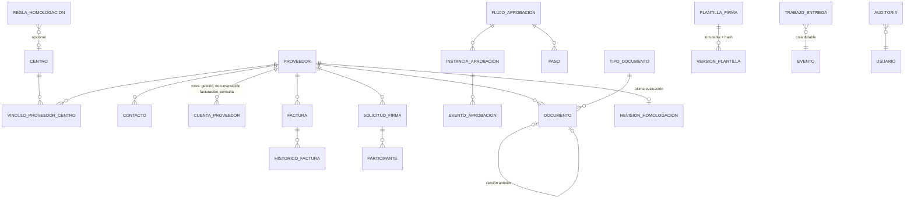
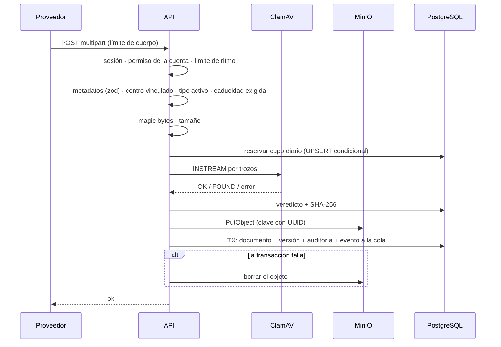
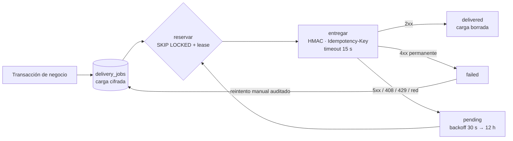

# Arquitectura en detalle

> Caso de estudio. Los nombres de modelos y módulos están simplificados. No hay datos reales.

## 1. Estructura

```
src/
├── app/
│   ├── admin/(panel)/      # panel interno: proveedores, documentos, facturas, firmas,
│   │                       # aprobaciones, pendientes, tickets, configuración
│   ├── proveedor/(portal)/ # portal del proveedor: mi empresa, mis documentos, mis facturas,
│   │                       # mis firmas, mis tickets
│   └── api/                # subidas, descargas por streaming, firmas, exportaciones,
│                           # 2FA, webhook entrante, salud y operaciones
├── components/             # UI por dominio + shadcn/ui
├── lib/
│   ├── actions/            # Server Actions por entidad
│   ├── approvals/          # transición CAS, efectos, rangos de importe
│   ├── auth/               # permisos, sesiones, 2FA, códigos de respaldo, dispositivos
│   ├── delivery/           # cola durable: encolar, reservar, entregar, reintentar
│   ├── documents/          # versiones y recordatorios de caducidad
│   ├── signatures/         # sello PDF, política de firma, plantillas versionadas
│   ├── storage/            # validación, antivirus, cupo diario, S3, descarga
│   ├── suppliers/          # homologación, reglas adicionales, reevaluación periódica
│   ├── webhooks/           # catálogo de eventos y emisor
│   └── validations/        # esquemas zod
└── middleware.ts           # CSP con nonce, protección de rutas
```

## 2. Modelo de datos a alto nivel



| Entidad | Detalles relevantes |
|---|---|
| Proveedor | Estado (`pendiente → activo ⇄ suspendido → inactivo`), actividad, **nivel de riesgo (1–4)**, responsable interno, código interno por actividad |
| Documento | Estado (`requerido · pendiente_revision · aprobado · rechazado · caducado`), fechas de emisión y caducidad, centro opcional, **cadena de versiones**: una renovación aprobada retira la anterior |
| Factura | Estado (`borrador → enviada → en_revision → aprobada / rechazada → pagada`), importes validados en servidor, albarán adjunto, histórico de estados |
| Flujo de aprobación | Tipo de entidad, centro opcional, **rango de importe**, obligatorio o no, pasos ordenados |
| Instancia de aprobación | Paso actual, estado, iniciador, **revisión de la entidad al empezar** |
| Solicitud de firma | Requisito que cubre, centro, vencimiento, plantilla y versión, hashes del original y del firmado |
| Seguridad de ficheros | Clave de almacenamiento, veredicto (`clean · blocked · error`), SHA-256 y fecha del análisis |
| Trabajo de entrega | Canal (correo o webhook), carga **cifrada**, clave de deduplicación, intentos, *lease*, caducidad |

### Niveles de riesgo (genérico)

| Nivel | Perfil | Exigencias crecientes |
|---|---|---|
| 1 | Proveedor ordinario, sin acceso habitual al centro | Datos fiscales y bancarios, evaluación periódica |
| 2 | Su personal accede al centro | + seguro, formación preventiva, confidencialidad y normas de acceso |
| 3 | Puede afectar a residentes, instalaciones o datos | + autorizaciones, fichas técnicas, protección de datos y plan de contingencia |
| 4 | Crítico para la continuidad | + tiempos de respuesta, continuidad y alternativa; **revisión cada 6 meses** en lugar de 12 |

## 3. Flujos principales

### Subida de un documento



### Homologación

1. Se da de alta el proveedor en `pendiente`, con su actividad, nivel, centros y responsable.
2. El proveedor sube documentos y firma lo que se le pide.
3. Se inicia un flujo de aprobación de tipo «proveedor».
4. En la última aprobación, dentro de la transacción, se evalúa el expediente completo. Si falta algo, **se rechaza la decisión con la lista de lo que falta**.
5. Cada cinco minutos, una tarea con *advisory lock* reevalúa lotes de hasta 25 proveedores sin revisar en 24 horas. Solo audita si cambia el resultado.

### Entrega de eventos



## 4. Despliegue

- Contenedor LXC con Docker Compose: `app`, `db` (PostgreSQL 16), `minio` y un *overlay* opcional con `clamav`. Las redes son una interna sin salida y una de salida solo para la aplicación.
- La imagen se construye en el servidor a partir de un paquete verificado. El lanzador de cada entrega:
  1. comprueba el origen y el SHA-256 del paquete;
  2. hace un snapshot del contenedor;
  3. copia el código y la base;
  4. construye;
  5. aplica migraciones **aditivas**;
  6. comprueba acceso, salud y permisos, y **vuelve a la imagen anterior** si algo falla.

  No restaura la base automáticamente, para no perder actividad posterior al despliegue.
- Un monitor local revisa cada 15 minutos disco, certificados TLS, contenedores y salud, y el resultado se ve en la pantalla de operaciones.

## Decisiones

| # | Decisión | Porqué | Alternativa descartada |
|---|---|---|---|
| 1 | Almacenamiento privado y descargas por la aplicación | Permisos y cuarentena comprobados en cada descarga, y revocables | URLs prefirmadas (no se pueden revocar) y bucket con dominio público |
| 2 | Antivirus autohospedado obligatorio | Ningún documento sale a terceros para analizarse. Si no hay análisis, no se acepta | Analizar solo en segundo plano (el fichero ya estaría disponible) y servicios de análisis en la nube |
| 3 | Validar el tipo por *magic bytes* | La extensión y el `Content-Type` los decide el cliente | Confiar en la extensión |
| 4 | Cupo diario de bytes persistente | Limita el abuso aunque haya varias instancias | Límite solo en memoria |
| 5 | Firma nativa en la aplicación | Una pieza menos y los documentos no salen del sistema | Servicio de firma autohospedado aparte (se usó y se retiró) y plataforma de firma SaaS |
| 6 | Firma con certificado «pendiente de validación» | Que haya una firma no demuestra que sea válida | Marcar como firmado al detectar una firma en el PDF |
| 7 | Homologación en una única función de servidor | Ninguna vía puede activar a un proveedor sin cumplir los requisitos | Validar en cada pantalla o acción por separado |
| 8 | Reglas adicionales que suman, nunca restan | Flexibilidad por centro sin poder rebajar la base | Reglas completamente libres |
| 9 | Aprobaciones con CAS y revisión de la entidad | Sin dobles decisiones ni aprobaciones sobre datos cambiados | Bloqueo optimista solo en la interfaz |
| 10 | Cola durable (*outbox*) con carga cifrada | Sin eventos perdidos ni duplicados, con reintentos | `fetch` a n8n dentro de la petición |
| 11 | n8n opcional | La aplicación no depende de un orquestador externo | Lógica de negocio en n8n |
| 12 | Permisos consultados en cada petición | Desactivar o cambiar permisos tiene efecto inmediato | Confiar en los datos del token hasta que caduque |
| 13 | Migraciones solo aditivas en las entregas | Siempre se puede volver a la imagen anterior | Migraciones destructivas junto al despliegue |
